<!--
  Profile README · Abdalla Elradi (@a-elradi)
  Every custom visual here is an animated SVG generated by scripts/build_assets.py.
  Dark / light variants swap automatically with GitHub's theme via <picture>.
-->

<picture>
  <source media="(prefers-color-scheme: dark)" srcset="assets/hero-dark.svg">
  
</picture>

 

<!-- ───────────── NAV ───────────── -->

  
  
  
  
  
  
  
  
  

<!-- ───────────── SOCIAL ───────────── -->

  
  
  
  
  

<picture>
  <source media="(prefers-color-scheme: dark)" srcset="https://readme-typing-svg.demolab.com?font=Segoe+UI&weight=700&size=26&duration=2600&pause=900&color=34D399&center=true&vCenter=true&width=980&height=56&lines=Informatics+Engineer+%C2%B7+AI+%C2%B7+Computer+Vision+%C2%B7+Robotics;AI+Automation+Engineer+%40+Glam+Moda+WLL;Building+an+autonomous+warehouse+robot+on+ROS+2+%2B+Jetson;Shipping+AI+agents+that+run+real+customer+support;President+%26+Founder+%E2%80%94+UTB+IoT+Club+%C2%B7+150%2B+members;Huawei+ICT+Competition+%C2%B7+Top+5+National">
  
</picture>

  
  
  

<picture>
  <source media="(prefers-color-scheme: dark)" srcset="assets/status-dark.svg">
  
</picture>

 

<!-- ═══════════════════════════════════════════════════════════════════════ -->
<!--                                 ABOUT                                   -->
<!-- ═══════════════════════════════════════════════════════════════════════ -->

<picture>
  <source media="(prefers-color-scheme: dark)" srcset="assets/eyebrow-about-dark.svg">
  
</picture>

## 👋 About

<table>
<tr>
<td width="60%" valign="top">

### I build systems that **see, decide and act.**

I'm Abdalla, a senior **Informatics Engineering** student at the University of Technology Bahrain and an **AI Automation Engineer at Glam Moda WLL**, where I ship AI agents that run real customer-support operations across Instagram, WhatsApp and email for three regional Shopify stores.

My core is **computer vision and robotics**: ROS 2 nodes on a Jetson Orin Nano, depth cameras, QR and box detection, and the web dashboard + MQTT bridge for an autonomous warehouse robot. On the side I design and build web apps and the occasional combat robot.

- 🎓 &nbsp;**Senior Informatics Engineering student** · University of Technology Bahrain · class of 2026
- 🏆 &nbsp;**Huawei ICT Competition** · Top 5 national with TECHTRAP
- 🥇 &nbsp;**Winner** · University Sumo Robot Competition
- 🤖 &nbsp;**President & Founder** · UTB IoT Club · 150+ members · Robotics & IoT instructor to 40+ students
- 🏀 &nbsp;**Mindset** · Basketball taught me discipline, focus and leadership
- 📍 &nbsp;**Manama, Bahrain** · open to opportunities in AI, computer vision, robotics and education

> *"Build with purpose. Lead with vision."*

</td>
<td width="40%" align="center" valign="middle">

<picture>
  <source media="(prefers-color-scheme: dark)" srcset="assets/avatar-dark.svg">
  
</picture>

</td>
</tr>
</table>

<table>
<tr>
<td width="58%" valign="top">

<picture>
  <source media="(prefers-color-scheme: dark)" srcset="assets/terminal-dark.svg">
  
</picture>

</td>
<td width="42%" valign="top">

### Right now

- 🔭 &nbsp;**Building** · AMR Warehouse Robot capstone — vision pipeline, web GUI and MQTT bridge
- ⚡ &nbsp;**Shipping** · WAZIR, a supervised department of nine AI agents running live e-commerce ops
- 🌱 &nbsp;**Learning** · Nav2 and SLAM tuning on Jetson, local LLM deployment, agent governance patterns
- 💬 &nbsp;**Ask me about** · OpenCV, ROS 2, ESP32/Teensy firmware, Shopify automations, AI support agents
- 🤝 &nbsp;**Open to** · internships, graduate roles, research and community collaborations
- 📫 &nbsp;**Reach me** · [Abdallaelsiddig.m@gmail.com](mailto:Abdallaelsiddig.m@gmail.com)

</td>
</tr>
</table>

<picture>
  <source media="(prefers-color-scheme: dark)" srcset="assets/stats-dark.svg">
  
</picture>

<picture>
  <source media="(prefers-color-scheme: dark)" srcset="assets/divider-dark.svg">
  
</picture>

<!-- ═══════════════════════════════════════════════════════════════════════ -->
<!--                              PROJECTS                                   -->
<!-- ═══════════════════════════════════════════════════════════════════════ -->

<picture>
  <source media="(prefers-color-scheme: dark)" srcset="assets/eyebrow-projects-dark.svg">
  
</picture>

## 🚀 Featured Projects

<table>
<tr>
<td width="46%" valign="top">
<a href="https://github.com/AMR-Warehouse-Team/AMR-Warehouse-System"></a>
</td>
<td width="54%" valign="top">

### 🏗️ Currently building — AMR Warehouse Robot

**Capstone 2026 · University of Technology Bahrain · team of four**

An autonomous mobile robot for pharmaceutical warehouse picking. It navigates to shelf locations with Nav2 + SLAM, verifies QR codes, and retrieves medicine boxes with a scissor lift and vacuum gripper — all on **ROS 2 Humble** running on a **Jetson Orin Nano**.

**My part:** the full vision stack (Orbbec Astra Pro RGB-D → OpenCV / pyzbar / YOLO → `amr_vision` ROS 2 node → `/qr_detection`) and the Flask web GUI + MQTT bridge that sends mission orders to the robot.

`ROS 2 Humble` `Jetson Orin Nano` `Nav2 · SLAM Toolbox` `OpenCV` `YOLO` `micro-ROS` `Teensy 4.1` `Flask` `MQTT`

</td>
</tr>
</table>

<picture>
  <source media="(prefers-color-scheme: dark)" srcset="assets/amr-pipeline-dark.svg">
  
</picture>

 

<table>
<tr>
<td width="33.33%" valign="top">
<a href="https://door2door-iota.vercel.app/"></a>

<b>Door2Door Delivery Platform</b> Marketing site, customer order tracking and a password-protected admin panel for a Kuwait delivery company. Next.js 16 · React 19 · Tailwind CSS 4.

</td>
<td width="33.33%" valign="top">
<a href="https://github.com/a-elradi/TECHTRAP"></a>

<b>TECHTRAP</b> Therapeutic gaming platform that assesses children's neuro-motor development from a webcam in real time and produces AI doctor reports. MindSpore · MediaPipe · OpenCV. Huawei ICT Competition.

</td>
<td width="33.33%" valign="top">
<a href="https://aelradi.engineer"></a>

<b>FireX Robot</b> Firefighter robot with AI-assisted navigation and rescue capabilities. ESP32 firmware in C++, MQTT telemetry and a live UI dashboard.

</td>
</tr>
<tr>
<td width="33.33%" valign="top">
<a href="https://github.com/a-elradi/Astra-Pro-Vision-Tests"></a>

<b>Astra Pro Vision Lab</b> Depth streaming, RGB-D fusion, QR and box detection, distance estimation and visual servoing experiments with the Orbbec Astra Pro — the groundwork for the AMR's vision node.

</td>
<td width="33.33%" valign="top">
<a href="https://github.com/a-elradi/Sumo-Robot"></a>

<b>Sumo Robot</b> 🥇 Winner of the university Sumo Robot competition. IR-remote-controlled combat robot with a dual-axis hammer, attack mode and max-power boost. Arduino · L298N.

</td>
<td width="33.33%" valign="top">
<a href="https://aelradi.engineer"></a>

<b>Robonexus</b> World-championship combat robotics entry — robot design, PCB and embedded work, and battle strategy.

</td>
</tr>
</table>

<b>➕ &nbsp;More builds</b> — web apps, ML, embedded and developer tooling

 
<table>
<tr>
<td width="50%">
<a href="https://github.com/a-elradi/portfolio-website">
<picture>
  <source media="(prefers-color-scheme: dark)" srcset="https://github-readme-stats.vercel.app/api/pin/?username=a-elradi&repo=portfolio-website&hide_border=true&bg_color=0a0a0a&title_color=34d399&icon_color=10b981&text_color=e5e7eb&show_owner=false">
  
</picture>
</a>
</td>
<td width="50%">
<a href="https://github.com/a-elradi/senior-saad-skill">
<picture>
  <source media="(prefers-color-scheme: dark)" srcset="https://github-readme-stats.vercel.app/api/pin/?username=a-elradi&repo=senior-saad-skill&hide_border=true&bg_color=0a0a0a&title_color=34d399&icon_color=10b981&text_color=e5e7eb&show_owner=false">
  
</picture>
</a>
</td>
</tr>
<tr>
<td width="50%">
<a href="https://github.com/a-elradi/AeroPredict-AI">
<picture>
  <source media="(prefers-color-scheme: dark)" srcset="https://github-readme-stats.vercel.app/api/pin/?username=a-elradi&repo=AeroPredict-AI&hide_border=true&bg_color=0a0a0a&title_color=34d399&icon_color=10b981&text_color=e5e7eb&show_owner=false">
  
</picture>
</a>
</td>
<td width="50%">
<a href="https://github.com/a-elradi/Smart-Glasses-Project-ESP32-CAM">
<picture>
  <source media="(prefers-color-scheme: dark)" srcset="https://github-readme-stats.vercel.app/api/pin/?username=a-elradi&repo=Smart-Glasses-Project-ESP32-CAM&hide_border=true&bg_color=0a0a0a&title_color=34d399&icon_color=10b981&text_color=e5e7eb&show_owner=false">
  
</picture>
</a>
</td>
</tr>
<tr>
<td width="50%">
<a href="https://github.com/a-elradi/Gesture-Controlled-Screen-Brightness-System">
<picture>
  <source media="(prefers-color-scheme: dark)" srcset="https://github-readme-stats.vercel.app/api/pin/?username=a-elradi&repo=Gesture-Controlled-Screen-Brightness-System&hide_border=true&bg_color=0a0a0a&title_color=34d399&icon_color=10b981&text_color=e5e7eb&show_owner=false">
  
</picture>
</a>
</td>
<td width="50%">
<a href="https://github.com/a-elradi/Astra-Pro-Vision-Tests">
<picture>
  <source media="(prefers-color-scheme: dark)" srcset="https://github-readme-stats.vercel.app/api/pin/?username=a-elradi&repo=Astra-Pro-Vision-Tests&hide_border=true&bg_color=0a0a0a&title_color=34d399&icon_color=10b981&text_color=e5e7eb&show_owner=false">
  
</picture>
</a>
</td>
</tr>
</table>

| Project | What it is | Stack |
|---|---|---|
| **portfolio-website** ⭐ 5 | aelradi.engineer — animated 3D background, FAQ chat agent, live availability calendar, certificate gallery | Next.js · React · Tailwind |
| **senior-saad-skill** ⭐ 4 | "SAAD": a Claude Code skill that turns a project idea into a full system-design package (architecture, UX, prompts) | Claude Code · Markdown |
| **AeroPredict-AI** | Flight on-time / delayed / cancelled prediction on 120k+ BTS & FAA flights with calibrated XGBoost and a Chart.js dashboard | Python · Flask · XGBoost |
| **Smart-Glasses-Project-ESP32-CAM** | Wearable camera prototype: ESP32-CAM firmware with SD buffering and a phone-side Flask receiver | C++ · ESP32 · Flask |
| **Gesture-Controlled-Screen-Brightness** | Hand-gesture control of screen brightness from a webcam | Python · OpenCV |

<picture>
  <source media="(prefers-color-scheme: dark)" srcset="assets/divider-dark.svg">
  
</picture>

<!-- ═══════════════════════════════════════════════════════════════════════ -->
<!--                         AI AUTOMATION SYSTEMS                           -->
<!-- ═══════════════════════════════════════════════════════════════════════ -->

<picture>
  <source media="(prefers-color-scheme: dark)" srcset="assets/eyebrow-systems-dark.svg">
  
</picture>

## ⚡ AI Automation Systems

<i>Production AI agents built for real business operations at Glam Moda: customer support across Instagram, WhatsApp and email for three regional Shopify stores, plus a governance layer that supervises them all. The code is proprietary; demos and write-ups live on <a href="https://aelradi.engineer">my portfolio</a>.</i>

<table>
<tr>
<td width="50%" valign="top">
<a href="https://aelradi.engineer"></a>
</td>
<td width="50%" valign="top">

### 🛡️ WAZIR — Agent Department

**A supervisor AI that runs eight specialist agents — with a kill switch.**

One supervisor coordinates eight specialists: automation & system health, support memory, market intelligence, SEO & content, technical QA, shopping experience, sales & retention and Google Ads. Each is locked to a **Read / Recommend / Execute** permission tier so no agent can act beyond its mandate. Every decision is written to an audit trail, and a Telegram kill switch pauses all write access instantly — no deploy required.

- **9 agents** · one supervisor, eight specialists
- **3-tier permissions** · Read / Recommend / Execute
- **Kill switch** · `/pause` `/resume` `/status` over Telegram
- **Audit trail** · trigger → decision → approval → result
- **Ops dashboard** · sales, automation health, department status

</td>
</tr>
</table>

<picture>
  <source media="(prefers-color-scheme: dark)" srcset="assets/wazir-arch-dark.svg">
  
</picture>

 

<table>
<tr>
<td width="33.33%" valign="top">
<a href="https://aelradi.engineer"></a>

<b>Instagram Support Agent</b> One AI, four brand accounts, zero public order leaks.

How it works

<ul>
<li>Handles DMs and comments on 4 Instagram business accounts, each with its own persona</li>
<li>Looks up live order status across 3 regional Shopify stores</li>
<li>Public acknowledgement on comments, private reply with the real details</li>
<li>Self-reply loop protection (dedupe + heuristic filter)</li>
<li>Human handoff into Telegram with <code>/now</code> <code>/done</code> <code>/list</code></li>
</ul>

</td>
<td width="33.33%" valign="top">
<a href="https://aelradi.engineer"></a>

<b>WhatsApp Support Agent</b> Region-aware support that knows which store your order is in.

How it works

<ul>
<li>Detects the customer's region from their number and routes to the right store</li>
<li>Structured AI output: reply / escalate / reason / buttons</li>
<li>Human handoff with a hold window — the bot stays silent mid-handover</li>
<li>Automatic end-of-day digest of conversations and escalations</li>
<li>Media attachments and 12-message conversation memory</li>
</ul>

</td>
<td width="33.33%" valign="top">
<a href="https://aelradi.engineer"></a>

<b>Email Support Agent</b> Reads the inbox, checks three stores, drafts before it ever sends.

How it works

<ul>
<li>Polls the shared mailbox every minute and filters newsletters, bounces and system senders</li>
<li>Parallel order lookup across 3 Shopify stores before the model answers</li>
<li>Confident replies go out threaded with the company signature; uncertain ones are held as drafts</li>
<li>Mail-loop safeguard pauses the bot after rapid-fire replies</li>
<li>Telegram alerts for escalations and workflow failures</li>
</ul>

</td>
</tr>
</table>

<picture>
  <source media="(prefers-color-scheme: dark)" srcset="assets/divider-dark.svg">
  
</picture>

<!-- ═══════════════════════════════════════════════════════════════════════ -->
<!--                               TECH STACK                                -->
<!-- ═══════════════════════════════════════════════════════════════════════ -->

<picture>
  <source media="(prefers-color-scheme: dark)" srcset="assets/eyebrow-skills-dark.svg">
  
</picture>

## 🧠 Tech Stack

<picture>
  <source media="(prefers-color-scheme: dark)" srcset="assets/ticker-dark.svg">
  
</picture>

 

<table>
<tr>
<td align="center" width="25%" valign="top">
<b>AI & Computer Vision</b>  
<picture>
  <source media="(prefers-color-scheme: dark)" srcset="https://skillicons.dev/icons?i=python,opencv,tensorflow,pytorch,sklearn&theme=dark&perline=3">
  
</picture>
  OpenCV · YOLO · TensorFlow · MindSpore · MediaPipe · XGBoost · scikit-learn
</td>
<td align="center" width="25%" valign="top">
<b>Robotics & Embedded</b>  
<picture>
  <source media="(prefers-color-scheme: dark)" srcset="https://skillicons.dev/icons?i=ros,cpp,arduino,raspberrypi,linux,bash&theme=dark&perline=3">
  
</picture>
  ROS 2 Humble · Nav2 · SLAM Toolbox · micro-ROS · Jetson Orin Nano · Teensy 4.1 · ESP32 · MQTT · LiDAR · depth cameras
</td>
<td align="center" width="25%" valign="top">
<b>Web & Apps</b>  
<picture>
  <source media="(prefers-color-scheme: dark)" srcset="https://skillicons.dev/icons?i=js,ts,react,nextjs,tailwind,nodejs,flask,html,css&theme=dark&perline=3">
  
</picture>
  Next.js · React · Tailwind CSS · Flask · Node.js · Vercel · Shopify
</td>
<td align="center" width="25%" valign="top">
<b>AI Agents, Data & Tools</b>  
<picture>
  <source media="(prefers-color-scheme: dark)" srcset="https://skillicons.dev/icons?i=mysql,sqlite,docker,git,github,vscode,figma,vercel,postman&theme=dark&perline=3">
  
</picture>
  Local LLMs · multi-agent orchestration · Telegram bots · Shopify Admin GraphQL · Instagram Graph API · WhatsApp Business API · Microsoft Graph · n8n
</td>
</tr>
</table>

<picture>
  <source media="(prefers-color-scheme: dark)" srcset="assets/divider-dark.svg">
  
</picture>

<!-- ═══════════════════════════════════════════════════════════════════════ -->
<!--                                SERVICES                                 -->
<!-- ═══════════════════════════════════════════════════════════════════════ -->

<picture>
  <source media="(prefers-color-scheme: dark)" srcset="assets/eyebrow-services-dark.svg">
  
</picture>

## 🛠️ Services

<table>
<tr>
<td align="center" width="20%" valign="top"><h3>🌐</h3><b>Websites & Web Apps</b>  Fast, responsive sites and full-stack apps with admin panels, tracking and booking flows. Next.js · React · Tailwind.</td>
<td align="center" width="20%" valign="top"><h3>⚙️</h3><b>Automation & Systems</b>  Workflow automation that connects your store, inbox, chat channels and dashboards so the busywork runs itself.</td>
<td align="center" width="20%" valign="top"><h3>🤖</h3><b>Robotics</b>  Autonomous and remote-controlled robots: ROS 2, embedded firmware, sensors, computer vision and control.</td>
<td align="center" width="20%" valign="top"><h3>🧠</h3><b>AI Agents</b>  Supervised multi-agent systems for support and operations, with permissions, audit trails and human handoff built in.</td>
<td align="center" width="20%" valign="top"><h3>📱</h3><b>Custom Applications</b>  Dashboards, internal tools, IoT apps and mobile-friendly interfaces tailored to how your team actually works.</td>
</tr>
</table>

  
  

<picture>
  <source media="(prefers-color-scheme: dark)" srcset="assets/divider-dark.svg">
  
</picture>

<!-- ═══════════════════════════════════════════════════════════════════════ -->
<!--                               EXPERIENCE                                -->
<!-- ═══════════════════════════════════════════════════════════════════════ -->

<picture>
  <source media="(prefers-color-scheme: dark)" srcset="assets/eyebrow-experience-dark.svg">
  
</picture>

## 💼 Experience

<picture>
  <source media="(prefers-color-scheme: dark)" srcset="assets/timeline-dark.svg">
  
</picture>

 

<b>AI Automation Engineer</b> · Glam Moda WLL · <i>Apr 2026 – Present</i>

<ul>
<li>Designed and shipped <b>WAZIR</b>, a supervised department of nine AI agents with tiered permissions, audit trail and a Telegram kill switch.</li>
<li>Built and run three production AI support agents (Instagram, WhatsApp, email) serving three regional Shopify stores with human handoff.</li>
<li>AI-driven workflow automation, process optimization and systems integration across the business.</li>
</ul>

<b>IT Technical Support & Web Developer</b> · Glam Moda · <i>Oct 2024 – Jan 2026</i>

<ul>
<li>Shopify specialization: storefront development, apps and integrations for a multi-brand retailer.</li>
<li>System optimization and IT support across the company's stores and back office.</li>
<li>Digital marketing support, including Google Ads creative work.</li>
</ul>

<b>President & Founder</b> · IoT Club, University of Technology Bahrain · <i>2023 – Present</i>

<ul>
<li>Founded the club and grew it to 150+ active members.</li>
<li>Organized quarterly innovation challenges that produced award-winning projects.</li>
</ul>

<b>Robotics & IoT Workshop Instructor</b> · University of Technology Bahrain · <i>2023 – Present</i>

<ul>
<li>Led hands-on workshops and robot competitions; mentored 40+ students.</li>
</ul>

<b>B.Sc. Informatics Engineering</b> · University of Technology Bahrain · <i>senior year · class of 2026</i>

<ul>
<li>Capstone: AMR Warehouse Robot — vision, web GUI and MQTT bridge (team of four).</li>
<li>Huawei ICT Competition — Top 5 national (TECHTRAP). Winner, university Sumo Robot competition.</li>
</ul>

<picture>
  <source media="(prefers-color-scheme: dark)" srcset="assets/divider-dark.svg">
  
</picture>

<!-- ═══════════════════════════════════════════════════════════════════════ -->
<!--                              CERTIFICATES                               -->
<!-- ═══════════════════════════════════════════════════════════════════════ -->

<picture>
  <source media="(prefers-color-scheme: dark)" srcset="assets/eyebrow-certificates-dark.svg">
  
</picture>

## 🏅 Certificates

<i>18 verified certificates across AI, networking, IoT, cloud and professional skills. Click any badge to open the certificate.</i>

<picture>
  <source media="(prefers-color-scheme: dark)" srcset="assets/divider-dark.svg">
  
</picture>

<!-- ═══════════════════════════════════════════════════════════════════════ -->
<!--                             GITHUB ACTIVITY                             -->
<!-- ═══════════════════════════════════════════════════════════════════════ -->

<picture>
  <source media="(prefers-color-scheme: dark)" srcset="assets/eyebrow-activity-dark.svg">
  
</picture>

## 📊 GitHub Activity

<table>
<tr>
<td width="50%">
<picture>
  <source media="(prefers-color-scheme: dark)" srcset="https://github-readme-stats.vercel.app/api?username=a-elradi&show_icons=true&hide_border=true&include_all_commits=true&count_private=true&rank_icon=github&bg_color=0a0a0a&title_color=34d399&icon_color=10b981&text_color=e5e7eb&ring_color=10b981">
  
</picture>
</td>
<td width="50%">
<picture>
  <source media="(prefers-color-scheme: dark)" srcset="https://streak-stats.demolab.com/?user=a-elradi&hide_border=true&background=0a0a0a&ring=10b981&fire=34d399&currStreakLabel=34d399&currStreakNum=ffffff&sideNums=ffffff&sideLabels=9ca3af&dates=6b7280&stroke=262626">
  
</picture>
</td>
</tr>
<tr>
<td width="50%">
<picture>
  <source media="(prefers-color-scheme: dark)" srcset="https://github-readme-stats.vercel.app/api/top-langs/?username=a-elradi&layout=donut&hide_border=true&langs_count=8&bg_color=0a0a0a&title_color=34d399&text_color=e5e7eb">
  
</picture>
</td>
<td width="50%" align="center" valign="middle">
<picture>
  <source media="(prefers-color-scheme: dark)" srcset="https://ghchart.rshah.org/10b981/a-elradi">
  
</picture>
 Contributions · last 12 months
</td>
</tr>
</table>

<picture>
  <source media="(prefers-color-scheme: dark)" srcset="https://raw.githubusercontent.com/a-elradi/a-elradi/output/github-snake-dark.svg">
  
</picture>

<picture>
  <source media="(prefers-color-scheme: dark)" srcset="assets/divider-dark.svg">
  
</picture>

<!-- ═══════════════════════════════════════════════════════════════════════ -->
<!--                                 CONTACT                                 -->
<!-- ═══════════════════════════════════════════════════════════════════════ -->

<picture>
  <source media="(prefers-color-scheme: dark)" srcset="assets/eyebrow-contact-dark.svg">
  
</picture>

## 📬 Contact

<picture>
  <source media="(prefers-color-scheme: dark)" srcset="assets/footer-dark.svg">
  
</picture>

© 2026 Abdalla Elradi · Manama, Bahrain · Custom visuals are animated SVGs generated by <a href="scripts/build_assets.py">scripts/build_assets.py</a> · Snake by <a href="https://github.com/Platane/snk">Platane/snk</a>

